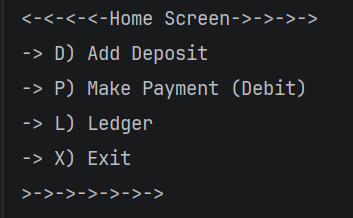
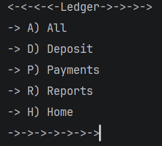
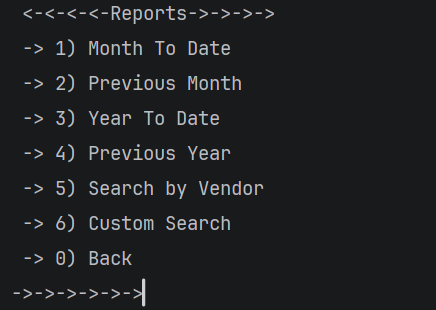
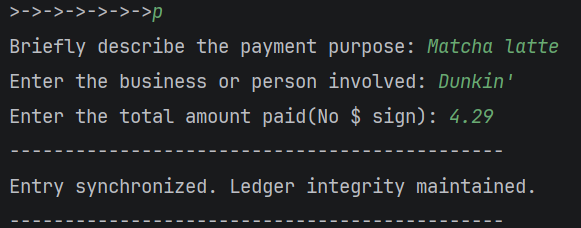
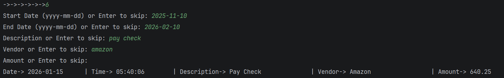
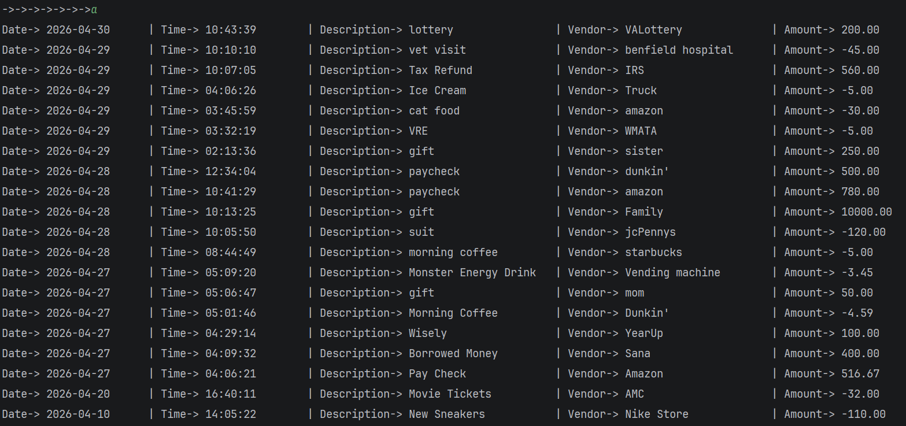

#  VaultCLI: Accounting Ledger Application

> **Project Overview:** VaultCLI is a Java-based command-line interface developed to record and track personal financial transactions. By utilizing a local CSV backend, the application ensures data persists across sessions, allowing for reliable long-term financial auditing.
---

## 📑 Table of Contents
* [Core Operational Pillars](#core-operational-pillars)
* [Search & Reporting Features](#search--reporting-features)
* [Input Validation & Stability](#input-validation--stability)
* [Application Preview](#application-preview)
* [How to Run the Project](#how-to-run-the-project)
* [CSV Data Format Preview](#csv-data-format-preview)
* [Technical Showcase](#technical-showcase)  
 
---

###  Core Operational Pillars

| Pillar                             | Description |
|:-----------------------------------| :--- |
| **Data Integrity and Presistence** | Parses `transactions.csv` into an `ArrayList` at startup. Updates both the memory list and the physical file simultaneously for real-time accuracy.<br/> Automatically assigns positive signs to deposits and negative signs to payments to eliminate mathematical user error and maintain an accurate balance. |
| **Search & Reporting Engine**      | Leverages `LocalDate` and `LocalTime` for time-based reporting (e.g., Month-to-Date). Supports "Live" data, including new entries in results immediately. |
| **Input Validation & Stability**   | To prevent runtime crashes, the application uses a centralized input utility that handles data conversion and error trapping. |

---

###  Search & Reporting Features

* **Type-Based Filtering:** Isolate entries to display only **Deposits** or **Payments**.
* **Vendor Search:** Query specific entities to see all associated business history.
* **Custom Search:** Perform multi-criteria queries by combining dates, descriptions, vendors, and amounts into a single filtered view.

---

### **Input Validation & Stability**
* **Prompt Management:** Reads all input as a `String` first to clear the Scanner buffer and prevent "skipped" prompts (Scanner Ghosting).
 <br>
* **Exception Handling:** Employs `try-catch` blocks during data conversion. If an invalid format is entered (e.g., text instead of a date), the program re-prompts the user instead of terminating.

---

## Application Preview

### Navigation & Menu
| Home Screen | Ledger Menu |                     Reports Menu                     |
| :---: | :---: |:----------------------------------------------------:|
|  |  |  |

### Entry & Search
|                      Add Transaction                      | Custom Search | Ledger Display |
|:---------------------------------------------------------:| :---: | :---: |
|  |  |  |

---

## How to Run the Project

### Prerequisites
* **Java Development Kit (JDK):** Version 17 or higher (Version 26 preferred).
* **IDE:** IntelliJ IDEA (recommended) or any Java-compatible editor.

### Steps to Run
1.  **Clone the Repository:**
    * Open your terminal and navigate to your desired directory.
    * Run: 
    ```
    git clone https://github.com/yu26s9-sky0-0glitch/vault-cli.git
    ```
2.  **Open in IntelliJ:**
    * Launch IntelliJ IDEA, select **Open**, and navigate to the `vault-cli`
      folder.
3.  **Prepare the Data Source:**
    * Ensure `transactions.csv` is located in the root directory of the project.
4.  **Launch:**
    * Locate `Main.java` in the `src` folder.
    * Right-click and select **Run 'Main.main()'**.
5.  **Navigate:**
    * Follow the on-screen menu prompts to record activity or generate reports.

### CSV Data Format Preview
```csv
date|time|description|vendor|amount
2025-08-14|08:52:40|Pizza|Uno|-15.99
2025-09-01|12:15:20|Monthly Rent|Leasing Office|-1250.00
2025-10-15|18:22:10|Dinner|Chipotle|-18.45
2025-11-28|10:00:00|Black Friday Sale|BestBuy|-89.99
```
</br>
---

### Technical Showcase

* **Robust Data Management:**
Chained Comparator Sorting; Originally, the application attempted to reverse
the ledger by inserting new CSV rows at index 0 of the ArrayList. I realized
this approach assumed the source file was already sorted. To ensure the 
is always accurate regardless of the CSV's state, I implemented a
programmatic sort using chained comparators.
This method sorts by date, uses the time as a tie-breaker for same-day entries,
and then reverses the entire collection to ensure the newest transactions appear first.
```java
    public static ArrayList<Transaction> sortLedger(ArrayList<Transaction> ledgerLoader) {

        ledgerLoader.sort(
                Comparator.comparing(Transaction::getDate)
                        .thenComparing(Transaction::getTime)
                        .reversed()
        );
        return ledgerLoader;
    }
```
<br/>

* **The "Gatekeeper" Filter Pattern:**
The Custom Search engine utilizes an Early Return pattern to handle multi-criteria
filtering. Rather than using complex nested if-else blocks, the "Gatekeeper" logic
evaluates each transaction against active search variables. The method checks five
optional fields: Start Date, End Date, Description, Vendor, and Amount. If a search
field is left blank, the system bypasses that specific check. If a field contains
data and the transaction fails to meet that criteria, the method exits immediately.
This flat logic structure improves code readability and ensures that only transactions
matching all user-defined parameters are returned.

```java
    private static boolean filterPassed(Transaction t, LocalDate startDate,
                                        LocalDate endDate, String description,
                                        String vendor, String amountInput) {
        if(startDate != null  && t.getDate().isBefore(startDate) )return false;
        if(endDate!=null && t.getDate().isAfter(endDate))return false;
        if(!description.isEmpty() && !t.getDescription().equalsIgnoreCase(description))return false;
        if(!vendor.isEmpty() && !t.getVendor().equalsIgnoreCase(vendor))return false;
        if(!amountInput.isEmpty() && t.getAmount() != Double.parseDouble(amountInput))return false;
        return true;
    }
```